#  Deploy  Elasticsearch in a Cluster


We are going to create a cluster with 3 nodes, 1 master node and 2  data nodes by using CentOS Linux 7 


### Master Node Setup

The first computer that we will connect will be the master computer.

Using the Secure Shell (SSH), log in  via the public IP address.

Become the `root` user with:

```
sudo su -
```

Import the Elastic GPG key:

```
rpm --import https://artifacts.elastic.co/GPG-KEY-elasticsearch
```

Download the Elasticsearch 7.6 RPM:

```
curl -O https://artifacts.elastic.co/downloads/elasticsearch/elasticsearch-7.6.0-x86_64.rpm
```

Install Elasticsearch:

```
rpm --install elasticsearch-7.6.0-x86_64.rpm
```

Configure Elasticsearch to start on system boot:

```
systemctl enable elasticsearch
```

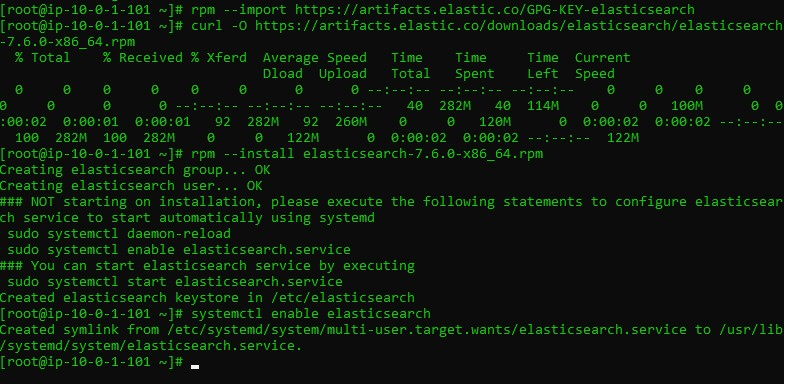

Configure the elasticsearch.yml per instructions.


Open the `elasticsearch.yml` file:

```
vim /etc/elasticsearch/elasticsearch.yml
```

Change the following line:

```
#cluster.name: my-application
```

to

```
cluster.name: cluster-1
```

Press the letter i on your keyboard to enter INSERT mode in vim.


Change the following line on master-1:

```
#node.name: node-1
```

to

```
node.name: master-1
```

Change

```
#network.host: 192.168.0.1
```

to

```
network.host: [_local_,_site_]
```

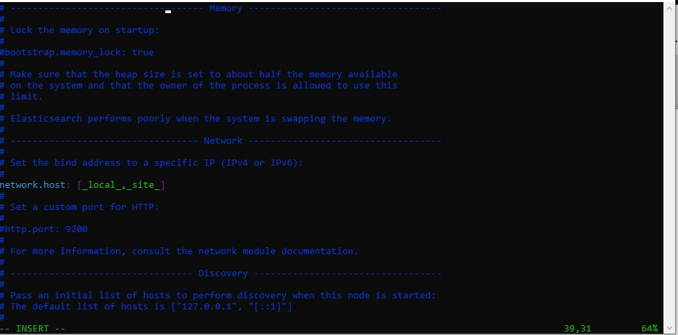

change

```
#discovery.seed_hosts: ["host1", "host2"]
```


to

```
discovery.seed_hosts: ["10.0.1.101"]
```


and change

```
#cluster.initial_master_nodes: ["node-1", "node-2"]
```

to

```
cluster.initial_master_nodes: ["master-1"]
```


we add the following lines

```
node.master: true
node.data: false
node.ingest: false
node.ml: false
```


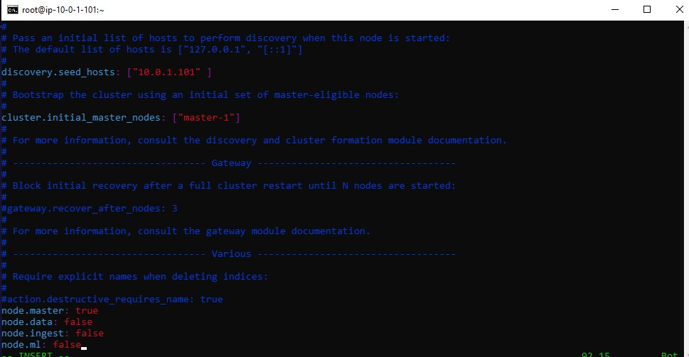

Then save and quit.

To save the file and exit the editor simultaneously, press `Esc` to switch to normal mode, type `:wq` and hit `Enter`.


###  Node 1  Setup

We conect now the the node 1 again by using the Secure Shell (SSH), log in  via the public IP address.

and we repeate the same steps

Become the `root` user with:

```
sudo su -
```

Import the Elastic GPG key:

```
rpm --import https://artifacts.elastic.co/GPG-KEY-elasticsearch
```

Download the Elasticsearch 7.6 RPM:

```
curl -O https://artifacts.elastic.co/downloads/elasticsearch/elasticsearch-7.6.0-x86_64.rpm
```

Install Elasticsearch:

```
rpm --install elasticsearch-7.6.0-x86_64.rpm
```

Configure Elasticsearch to start on system boot:

```
systemctl enable elasticsearch
```


we configure  the  node's elasticsearch.yml per instructions.

Open the `elasticsearch.yml` file:

```
vim /etc/elasticsearch/elasticsearch.yml
```

Change the following line:

```
#cluster.name: my-application
```

to

```
cluster.name: cluster-1
```


Change the following line on data-1:

```
#node.name: node-1
```

to

```
node.name: data-1
```


Change the following line on data-1:

```
#node.attr.rack: r1
```

to

```
node.attr.temp: hot
```


```
node.name: master-1
```

Change

```
#network.host: 192.168.0.1
```

to

```
network.host: [_local_,_site_]
```


change

```
#discovery.seed_hosts: ["host1", "host2"]
```


to

```
discovery.seed_hosts: ["10.0.1.101"]
```


and change

```
#cluster.initial_master_nodes: ["node-1", "node-2"]
```

to

```
cluster.initial_master_nodes: ["master-1"]
```

Add the following lines on data-1:

```
node.master: false
node.data: true
node.ingest: true
node.ml: false
```


###  Node 2  Setup

We conect now the the node 2 again by using the Secure Shell (SSH), log in  via the public IP address.

and we repeat the same steps

```
sudo su -
```

Import the Elastic GPG key:

```
rpm --import https://artifacts.elastic.co/GPG-KEY-elasticsearch
```

Download the Elasticsearch 7.6 RPM:

```
curl -O https://artifacts.elastic.co/downloads/elasticsearch/elasticsearch-7.6.0-x86_64.rpm
```

Install Elasticsearch:

```
rpm --install elasticsearch-7.6.0-x86_64.rpm
```

Configure Elasticsearch to start on system boot:

```
systemctl enable elasticsearch
```


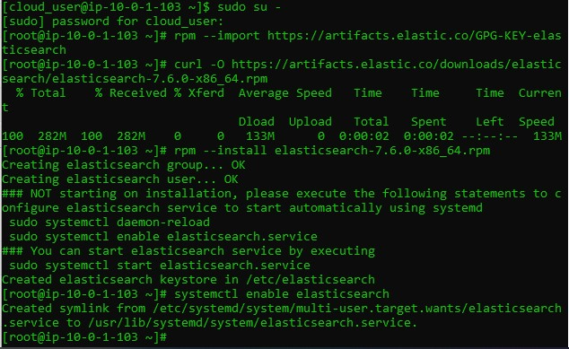


Configure  elasticsearch.yml per instructions.


Log in to each node and become the `root` user:

```
sudo su -
```

Open the `elasticsearch.yml` file:

```
vim /etc/elasticsearch/elasticsearch.yml
```


Change the following line:

```
#cluster.name: my-application
```

to

```
cluster.name: cluster-1
```


Change the following line on data-2:

```
#node.name: node-1
```

to

```
node.name: data-2
```

Change the following line on data-2:

```
#node.attr.rack: r1
```

to

```
node.attr.temp: warm
```


Change

```
#network.host: 192.168.0.1
```

to

```
network.host: [_local_,_site_]
```


change

```
#discovery.seed_hosts: ["host1", "host2"]
```


to

```
discovery.seed_hosts: ["10.0.1.101"]
```


and change

```
#cluster.initial_master_nodes: ["node-1", "node-2"]
```

to

```
cluster.initial_master_nodes: ["master-1"]
```

Add the following lines on data-2:

```
node.master: false
node.data: true
node.ingest: true
node.ml: false
```


Configure the heap for each node per instructions.

Log in to the master node 

```
sudo su -
```

Open the `jvm.options` file:

```
vim /etc/elasticsearch/jvm.options
```

Change the following lines:

```
-Xms1g
-Xmx1g
```

to

```
-Xms768m
-Xmx768m
```


Log in to each data node and become the `root` user:

```
sudo su -
```

Open the `jvm.options` file:

```
vim /etc/elasticsearch/jvm.options
```

Change the following lines:

```
-Xms1g
-Xmx1g
```

to

```
-Xms2g
-Xmx2g
```

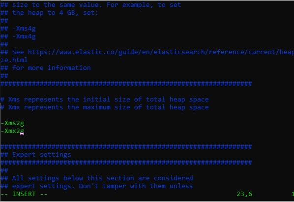


Start Elasticsearch on each node.

```
systemctl start elasticsearch
```

Check the startup process:

```
less /var/log/elasticsearch/cluster-1.log
```

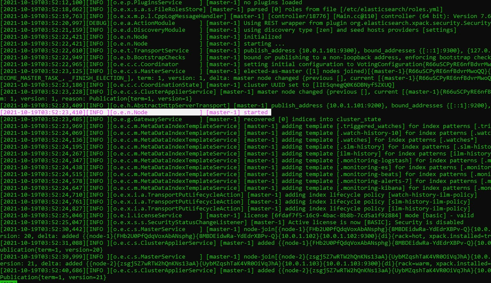

from there we can see

```
[master-1] started
```

and

```
 [master-1] added node-1
```

```
 [master-1] added node-2
```


Check the node configuration:

```
curl localhost:9200
```


```
curl localhost:9200/_cat/nodes?v
```


to get more information about your cluster  you can use cat to know 

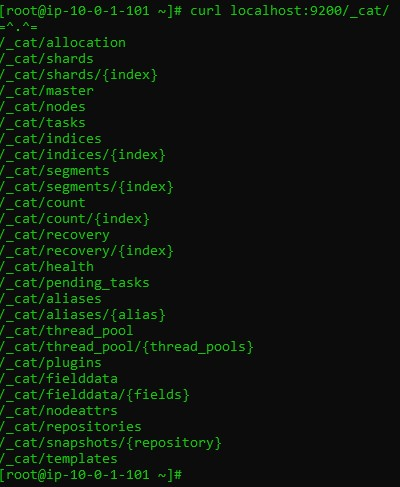


# Configure Kibana for an Elasticsearch Cluster


Install Kibana on the master-1 node.

Using the Secure Shell (SSH), log in to the `master-1` node as `cloud_user` via the public IP address.

Become the `root` user with:

```
sudo su -
```

Download the Kibana 7.6 RPM:

```
curl -O https://artifacts.elastic.co/downloads/kibana/kibana-7.6.0-x86_64.rpm
```

Install Kibana:

```
rpm --install kibana-7.6.0-x86_64.rpm
```

Configure Kibana to start on system boot:

```
systemctl enable kibana
```


Log in to the `master-1` node and become the `root` user with:

```
sudo su -
```

Open the `/etc/kibana/kibana.yml` file:

```
vim /etc/kibana/kibana.yml
```

Change the following line:

```
#server.port: 5601
```

to

```
server.port: 8080
```

Change the following line:

```
#server.host: "localhost"
```

to

```
server.host: "10.0.1.101"
```


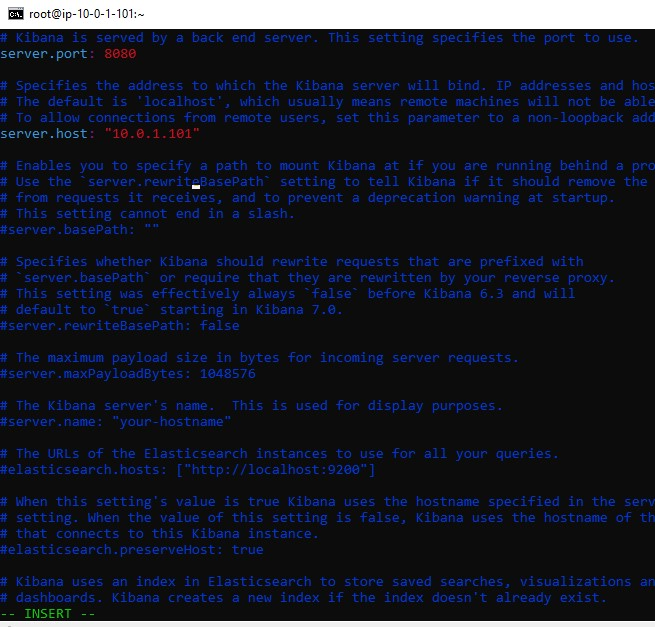


Start Kibana:

```
systemctl start kibana
```


After Kibana has finished starting up, which may take a few minutes navigate to `http://PUBLIC_IP_ADDRESS_OF_MASTER-1:8080` in your web browser 


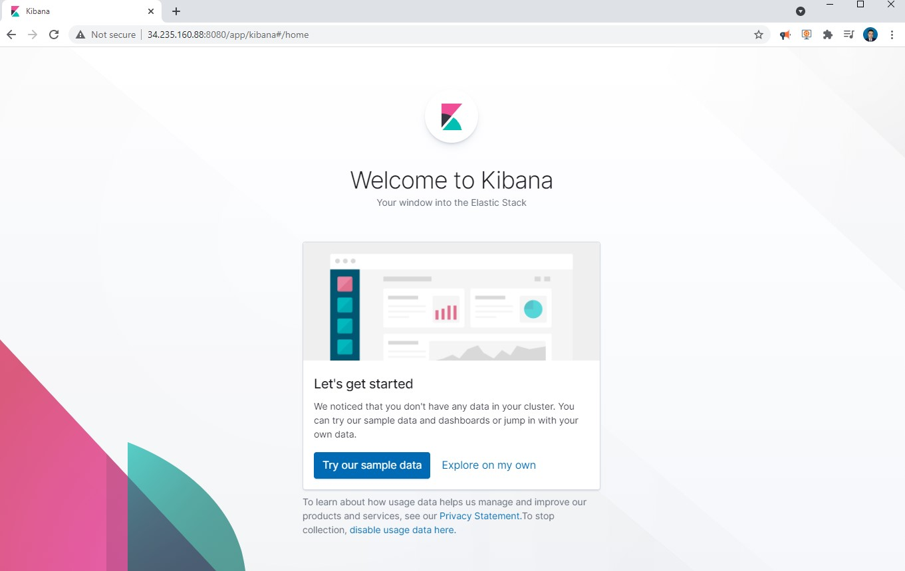


click `Explore on my own`

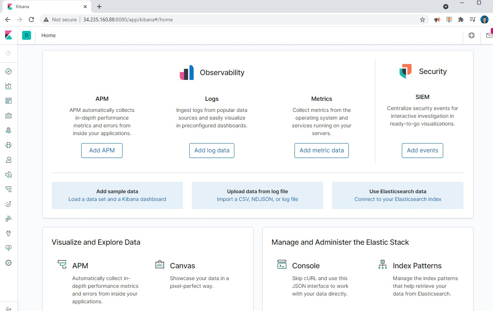


and navigate to **Dev Tools** > **Console**.

Check the node status of the cluster via the console tool with:

```
GET _cat/nodes?v
```


## Deploy  Elasticsearch with Amazon OpenSearch

OpenSearch is a community-driven, open source search and analytics suite derived from Apache 2.0 licensed Elasticsearch 7.10.2 & Kibana 7.10.2. It consists of a search engine daemon, OpenSearch, and a visualization and user interface, OpenSearch Dashboards.

 

We login to our AWS console and then we search for **Opensearch** 

Let us create a cluster in AWS by creating a domain in OpenSearch.


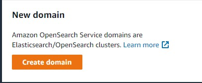


we name the Domain name as `cluster-1`


then we select the instance type  `r5.large.search`  and only 1  node, for this test


then in Network we choose `Public access` and without `fine grained` access, for production we should use VPC and Fine grained access control. 


For the access policy we choose configure our level,  we choose our current ip

for exaample [https://www.whatsmyip.org/](https://www.whatsmyip.org/) and copy your address ip and paste in the principal


The Access Policy   generated in JSON format  should be something similar like

```json
{
  "Version": "2012-10-17",
  "Statement": [
    {
      "Effect": "Allow",
      "Principal": {
        "AWS": "*"
      },
      "Action": [
        "es:*"
      ],
      "Resource": "arn:aws:es:us-east-1:298039135746:domain/cluster-1/*",
      "Condition": {
        "IpAddress": {
          "aws:SourceIp": [
            "97.14.131.224"
          ]
        }
      }
    }
  ]
}
```

then we create our cluster


we have to wait at least 10 minutes


after a while  the status should be **Active**


Then we go to our terminal, and lets get information about our cluster

we will  use the command `curl -XGET` + `Domain endpoint`   , we copy the Domain endpoint from our AWS console , in my case is `https://search-cluster-1-qtas43cbwk4zwyvjfyfr4ic4ye.us-east-1.es.amazonaws.com/`  you should have something similar, then  type 

```
curl -XGET https://search-cluster-1-qtas43cbwk4zwyvjfyfr4ic4ye.us-east-1.es.amazonaws.com/
```

you will get

```
{
  "name" : "c3812926142472338371572d47cc4d1a",
  "cluster_name" : "298039135746:cluster-1",
  "cluster_uuid" : "OdNhU9BkRou1MT77Ue4jBA",
  "version" : {
    "distribution" : "opensearch",
    "number" : "1.0.0",
    "build_type" : "tar",
    "build_hash" : "unknown",
    "build_date" : "2021-08-20T12:03:05.728738Z",
    "build_snapshot" : false,
    "lucene_version" : "8.8.2",
    "minimum_wire_compatibility_version" : "6.8.0",
    "minimum_index_compatibility_version" : "6.0.0-beta1"
  },
  "tagline" : "The OpenSearch Project: https://opensearch.org/"
}
```

The next step is download a test json to check our cluster.

```
curl -OL https://github.com/ruslanmv/Deploy-Elasticsearch-and-Kibana-in-a-Cluster/raw/master/movies.json
```


The next step is  upload  this json to the cluster by using the command

`curl -XPUT` + `Domain endpoint`  , 


```
curl -XPUT https://search-cluster-1-qtas43cbwk4zwyvjfyfr4ic4ye.us-east-1.es.amazonaws.com/_bulk?pretty --data-binary @movies.json -H 'Content-Type: application/json'
```

the output will be 

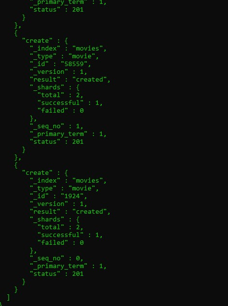

then let us check if was loaded

`curl -XPGET` + `Domain endpoint`  , +`/movies/_search?pretty` 

```
curl   -XGET  https://search-cluster-1-qtas43cbwk4zwyvjfyfr4ic4ye.us-east-1.es.amazonaws.com/movies/_search?pretty 
```

and then output should be 


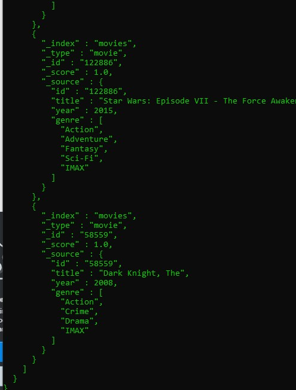


Finally we can copy address of the the **OpenSearch Dashboard** url and paste in the browser


in th OpenSearch  click **Explore on my own**, we go to **Management Tab**  then  **Stack Management** then **Index Pattern**

Then **Create Index Pattern**

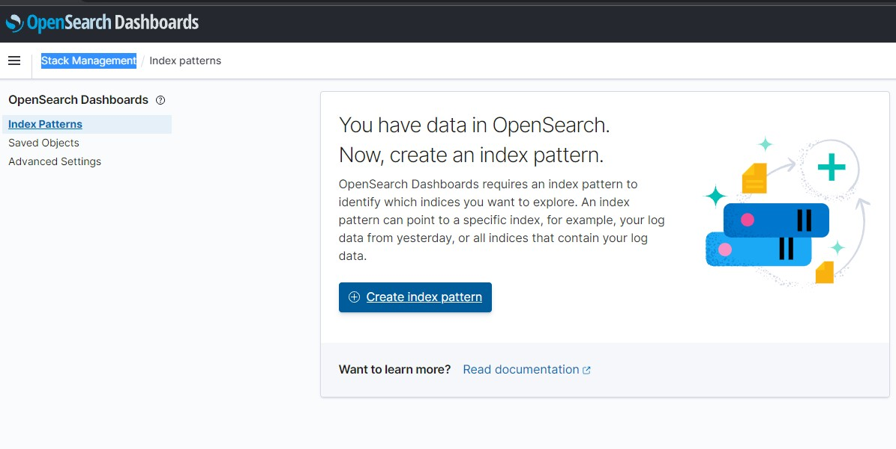

and write `movies*`

Below the index pattern 

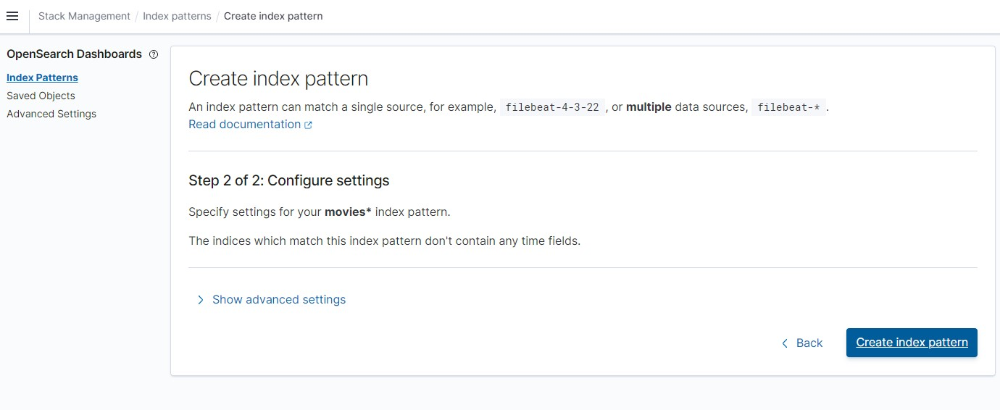

we will get

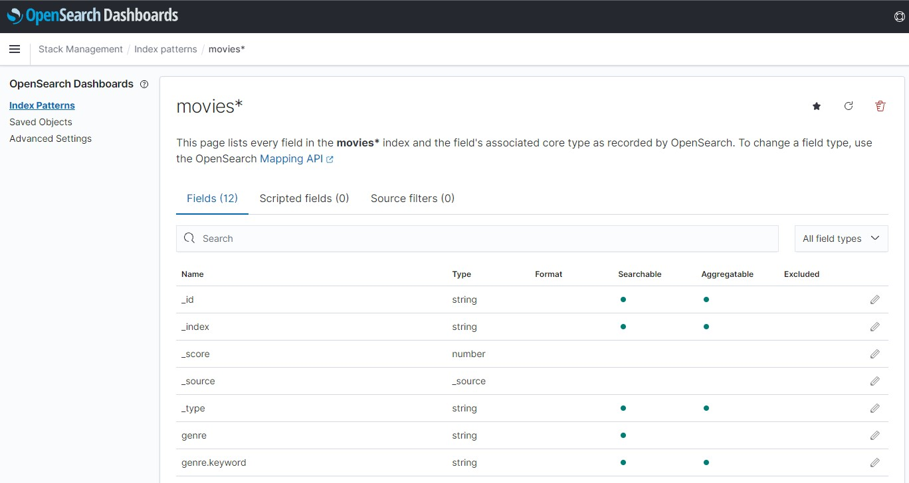

finally you can analyze them

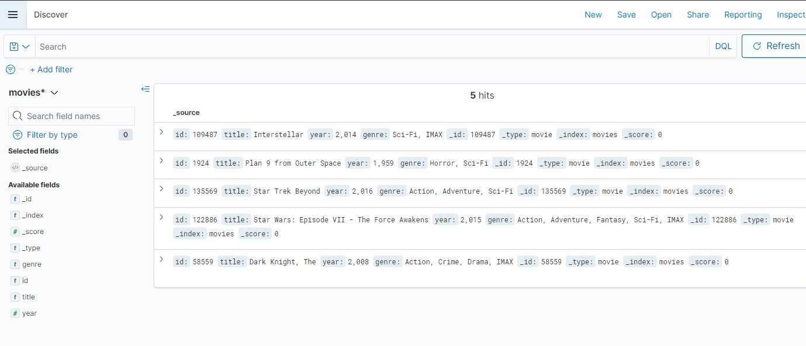

After finished this project, you can Delete the Domain to avoid charges in AWS.

**Congratulations!** We have installed Elasticsearch and Kibana and Opensearch in a Cluster

